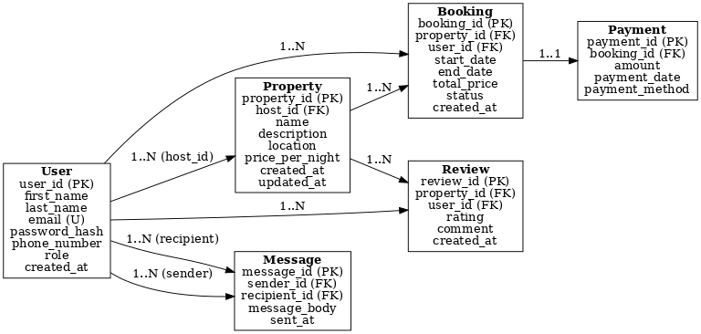

# 📊 Airbnb Database ERD Requirements

## 1. Objective

The goal of this task is to define the **Entities** and **Relationships** for the Airbnb clone database.  
We use an Entity-Relationship Diagram (ERD) to visually represent how the data is structured and connected.

---

## 2. Entities & Attributes

### 🧑 User

- `user_id` (UUID, PK, Indexed)
- `first_name` (VARCHAR, NOT NULL)
- `last_name` (VARCHAR, NOT NULL)
- `email` (VARCHAR, UNIQUE, NOT NULL)
- `password_hash` (VARCHAR, NOT NULL)
- `phone_number` (VARCHAR, NULL)
- `role` (ENUM: guest, host, admin, NOT NULL)
- `created_at` (TIMESTAMP, DEFAULT CURRENT_TIMESTAMP)

---

### 🏠 Property

- `property_id` (UUID, PK, Indexed)
- `host_id` (FK → User.user_id)
- `name` (VARCHAR, NOT NULL)
- `description` (TEXT, NOT NULL)
- `location` (VARCHAR, NOT NULL)
- `price_per_night` (DECIMAL, NOT NULL)
- `created_at` (TIMESTAMP, DEFAULT CURRENT_TIMESTAMP)
- `updated_at` (TIMESTAMP, ON UPDATE CURRENT_TIMESTAMP)

---

### 📅 Booking

- `booking_id` (UUID, PK, Indexed)
- `property_id` (FK → Property.property_id)
- `user_id` (FK → User.user_id)
- `start_date` (DATE, NOT NULL)
- `end_date` (DATE, NOT NULL)
- `total_price` (DECIMAL, NOT NULL)
- `status` (ENUM: pending, confirmed, canceled, NOT NULL)
- `created_at` (TIMESTAMP, DEFAULT CURRENT_TIMESTAMP)

---

### 💳 Payment

- `payment_id` (UUID, PK, Indexed)
- `booking_id` (FK → Booking.booking_id)
- `amount` (DECIMAL, NOT NULL)
- `payment_date` (TIMESTAMP, DEFAULT CURRENT_TIMESTAMP)
- `payment_method` (ENUM: credit_card, paypal, stripe, NOT NULL)

---

### ⭐ Review

- `review_id` (UUID, PK, Indexed)
- `property_id` (FK → Property.property_id)
- `user_id` (FK → User.user_id)
- `rating` (INTEGER, CHECK 1–5, NOT NULL)
- `comment` (TEXT, NOT NULL)
- `created_at` (TIMESTAMP, DEFAULT CURRENT_TIMESTAMP)

---

### 💬 Message

- `message_id` (UUID, PK, Indexed)
- `sender_id` (FK → User.user_id)
- `recipient_id` (FK → User.user_id)
- `message_body` (TEXT, NOT NULL)
- `sent_at` (TIMESTAMP, DEFAULT CURRENT_TIMESTAMP)

---

## 3. Relationships

- **User → Property**: 1 User (host) can list many Properties (1-to-Many).
- **User → Booking**: 1 User (guest) can create many Bookings (1-to-Many).
- **Property → Booking**: 1 Property can have many Bookings (1-to-Many).
- **Booking → Payment**: Each Booking can have 1 or many Payments (1-to-Many).
- **User → Review**: 1 User can leave many Reviews (1-to-Many).
- **Property → Review**: 1 Property can have many Reviews (1-to-Many).
- **User → Message (self-relationship)**: Users can send Messages to each other (Many-to-Many via sender_id and recipient_id).

---

## 4. ER Diagram

---

## 5. Constraints & Indexing

- **Unique constraints:** `User.email` must be unique.
- **Foreign keys:**
  - `Property.host_id` → `User.user_id`
  - `Booking.property_id` → `Property.property_id`
  - `Booking.user_id` → `User.user_id`
  - `Payment.booking_id` → `Booking.booking_id`
  - `Review.property_id` → `Property.property_id`
  - `Review.user_id` → `User.user_id`
  - `Message.sender_id` & `Message.recipient_id` → `User.user_id`
- **Check constraints:** `Review.rating` must be between 1 and 5.
- **Indexes:**
  - Primary keys are indexed automatically.
  - `User.email` for quick lookup.
  - Foreign keys (`property_id`, `booking_id`, etc.) for performance.

---

## ✅ Deliverables

- ER Diagram (`airbnb_erd.png`) saved in the `ERD/` directory.
- This `requirements.md` file documenting entities, relationships, and constraints.
